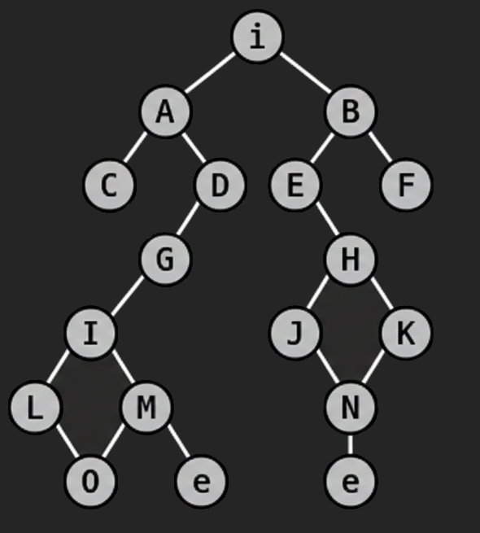

<table style="border-collapse: collapse; border: 2px solid black; font-family: monospace;">
<tr>
    <td style="border: 2px solid black; width: 50px; height: 50px;">&nbsp;</td>
    <td style="border: 2px solid black; width: 50px;">&nbsp;</td>
    <td style="border: 2px solid black; width: 50px; ">&nbsp;</td>
    <td style="border: 2px solid black; width: 50px;font-size: 20px; color: gray; " align="center">O</td>
    <td style="border: 2px solid black; width: 50px;font-size: 20px;color: gray;" align="center">L</td>
  </tr>
  <tr>
    <td style="border: 2px solid black; width: 50px; height: 50px;">&nbsp;</td>
    <td style="border: 2px solid black; width: 50px;">&nbsp;</td>
    <td style="border: 2px solid black; width: 50px; font-size: 20px; font-weight: bold;color: lightyellow;" align="center">e</td>
    <td style="border: 2px solid black; width: 50px;font-size: 20px;color: lightyellow;"align="center">M</td>
    <td style="border: 2px solid black; width: 50px;font-size: 20px;color: lightyellow;" align="center">I</td>
  </tr>
  <tr>
    <td style="border: 2px solid black; height: 50px;">&nbsp;</td>
    <td style="border: 2px solid black;">&nbsp;</td>
    <td style="border: 2px solid black;" bgcolor="red">&nbsp;</td>
    <td style="border: 2px solid black;" bgcolor="red">&nbsp;</td>
    <td style="border: 2px solid black;font-size: 20px;color: lightyellow;" align="center">G</td>
  </tr>
  <tr>
    <td style="border: 2px solid black; height: 50px; font-size: 20px; font-weight: bold;color: lightgreen;" align="center">e</td>
    <td style="border: 2px solid black;" bgcolor="red">&nbsp;</td>
    <td style="border: 2px solid black;font-size: 20px;color: gray;" align="center">C</td>
    <td style="border: 2px solid black;font-size: 20px;color: lightyellow;" align="center">A</td>
    <td style="border: 2px solid black;font-size: 20px;color: lightyellow;" align="center">D</td>
  </tr>
  <tr>
    <td style="border: 2px solid black; height: 50px;font-size: 20px;color: lightgreen;" align="center">N</td>
    <td style="border: 2px solid black;font-size: 20px;color: lightgreen;" align="center">J</td>
    <td style="border: 2px solid black;" bgcolor="red">&nbsp;</td>
    <td style="border: 2px solid black; font-size: 20px; font-weight: bold;" align="center">i</td>
    <td style="border: 2px solid black;" bgcolor="red">&nbsp;</td>
  </tr>
  <tr>
    <td style="border: 2px solid black; height: 50px;font-size: 20px;color: gray;" align="center">K</td>
    <td style="border: 2px solid black;font-size: 20px;color: lightgreen;" align="center">H</td>
    <td style="border: 2px solid black;font-size: 20px;color: lightgreen;" align="center">E</td>
    <td style="border: 2px solid black;font-size: 20px;color: lightgreen;" align="center">B</td>
    <td style="border: 2px solid black;font-size: 20px;color: gray;" align="center">F</td>
  </tr>
</table>

<pre style="font-family: monospace; line-height: 1.2; font-size: 16px;">
                 (i)
               /     \
            (A)       (B)
           /   \     /   \
         (C)   (D) (E)   (F)
              /       \
            (G)       (H)
           /         /   \
        (I)        (J)   (K)
       /   \          \ /   
     (L)   (M)        (N)
        \ /   \        |
        (O)   (e)     (e)
</pre>

## Seguimiento del Algoritmo

| Paso | Nodo Explorado | Frontera | Camino Resultante |
|:---:|:---|:---|:---|
| 1 | `(i)` | `[A, B]` | `(i)` |
| 2 | `A` | `[B, C, D]` | `(i) -> A` |
| 3 | `B` | `[C, D, E, F]` | `(i) -> B` |
| 4 | `C` | `[D, E, F, G]` | `(i) -> A -> C` |
| 5 | `D` | `[E, F, G]` | `(i) -> A -> D` |
| 6 | `G` | `[E, F, I]` | `(i) -> A -> D -> G` |